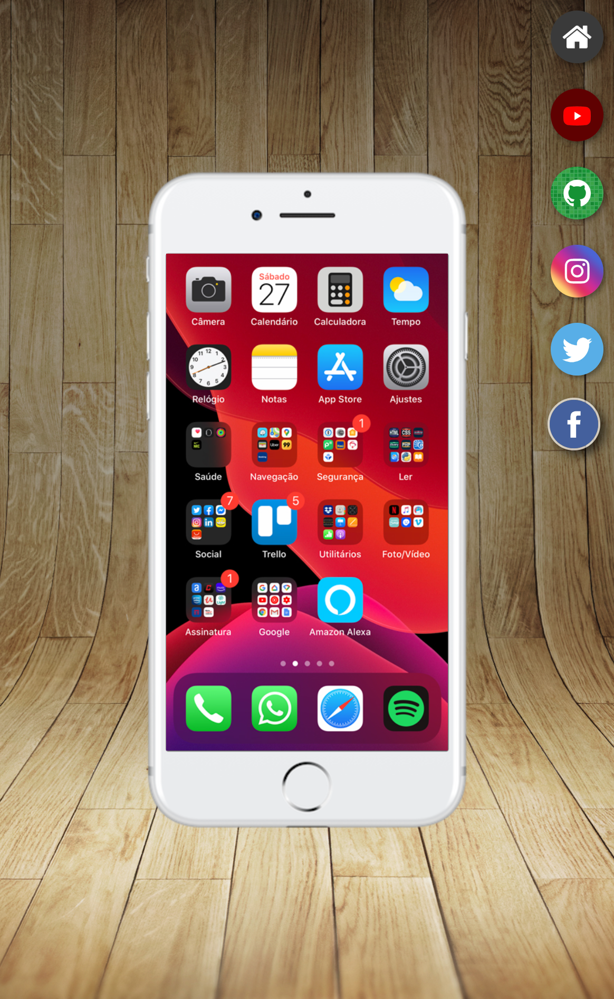

<h1 align="center"> Projeto-Redes-Sociais-HTML-CSS </h1>

Você pode visualizar o projeto através [DESSE LINK](https://projeto-redes-sociais-html-css.vercel.app/).

Mini Projeto do Capítulo 23 do curso de HTML-CSS do curso em vídeo.

  <a href="#-tecnologias">Tecnologias</a>&nbsp;&nbsp;&nbsp;|&nbsp;&nbsp;&nbsp;
  <a href="#-projeto">Projeto</a>&nbsp;&nbsp;&nbsp;|&nbsp;&nbsp;&nbsp;
  <a href="#-layout">Layout</a>&nbsp;&nbsp;&nbsp;|&nbsp;&nbsp;&nbsp;
  <a href="#memo-licença">Licença</a>

 

  

## 🚀 Tecnologias

Esse projeto foi desenvolvido com as seguintes tecnologias:

- HTML e CSS

## 💻 Projeto

Neste projeto foi utilizado um iframe que exibe varias redes sociais e contem um link para cada acessar essas redes em outra aba do navegador.

## 🔖 Layout

## :memo: Licença

Esse projeto está sob a licença MIT.

